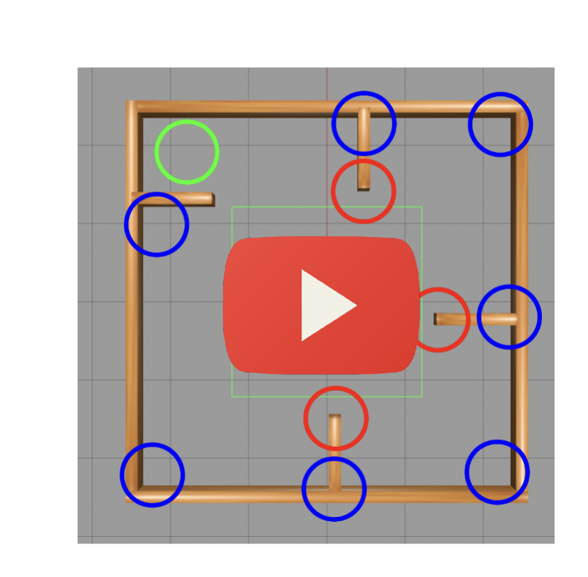
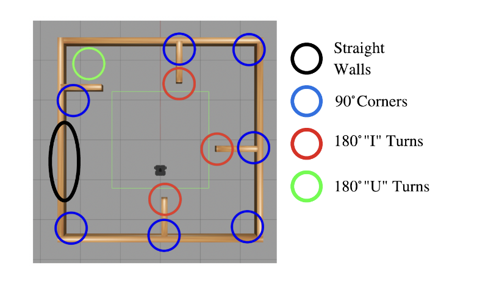
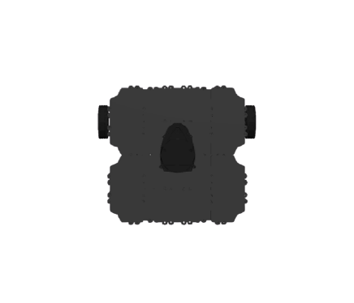
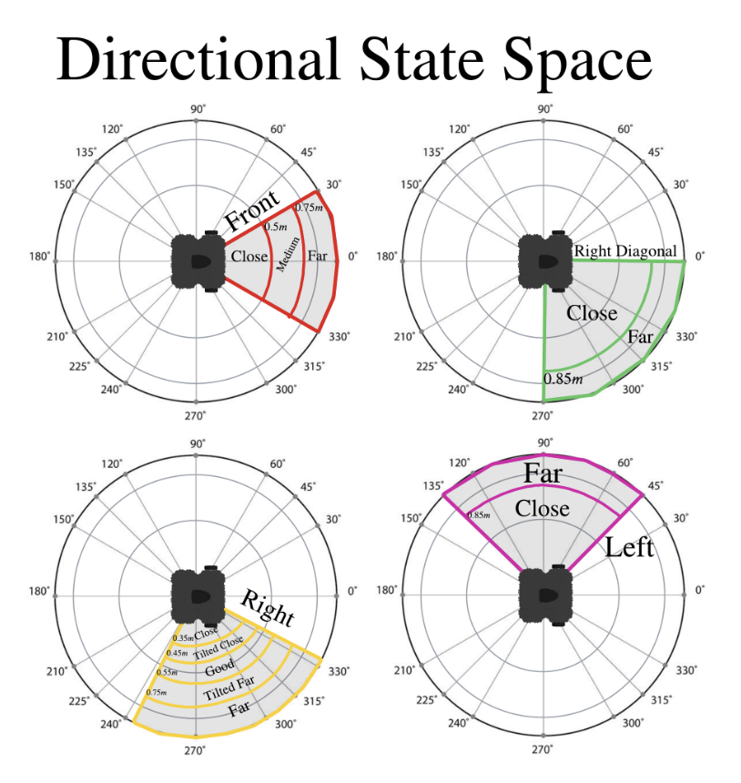

# Robotics - Reinforcement Learning: Wall Following

## Summary

This project explores the application of reinforcement learning algorithms to teach an autonomous mobile robot the task of following walls and avoiding obstacles in a fixed simulated environment. The primary goal is to develop an optimal policy that allows the robot to maintain a desired distance from walls while navigating efficiently and without crashing. The project focuses on two main reinforcement learning algorithms: Q-learning and SARSA. The robot's environment, state space, action space, reward function, and learning strategy are carefully designed and implemented. Evaluation metrics include learning convergence rate and accuracy, assessed through experiments conducted over multiple episodes. The results provide insights into the effectiveness of the learning algorithms and their ability to train the robot for successful wall-following behavior.

<div style="text-align:center;">
  
</div>

## Watch The Full Demo

Demo of turtlebot navigating the circumfrence of it's environment, along with training cycles for Q-learning and SARSA.

<div style="text-align:center;">
  <a href="https://youtu.be/Ce2aRc1InvM" target="_blank"></a>
</div>

Full report can be found in [reports/RL_For_Wall_Following_Report.pdf](reports/RL_For_Wall_Following_Report.pdf)

## Problem Formalism

Wall following, a fundamental behavior in mobile robotics, requires the robot to circumnavigate its environment while adhering to the topology of the surrounding walls. Successful wall following involves striking a delicate balance between speed and safety: moving too close to the wall risks collisions, while straying too far may lead to disorientation and loss of navigation reference.

The navigation task is formalized as follows: the robot is tasked with continuously moving forward while keeping a desired distance, $d_w$, from adjacent walls. This desired distance serves as a critical parameter, ensuring the robot maintains a balance between proximity to walls for efficient traversal and distance to prevent collisions. The optimal policy, defined by a mapping from states to control actions, dictates that the robot should maintain its distance from the wall at each time step without deviating from its forward trajectory or encountering obstacles.

To simplify the learning problem and focus on algorithm development, we employ a single static environment during training. This environment provides a controlled setting for the robot to learn navigation behaviors without the complexities introduced by stochastic elements. By isolating the navigation task to a fixed environment, we can systematically explore and evaluate reinforcement learning algorithms to teach the robot effective wall-following behavior.

<div style="text-align:center;">
  
</div>

## TurtleBot 3 Waffle Pi Overview

The project utilizes the TurtleBot 3 Waffle Pi model within the Gazebo simulation environment. The TurtleBot 3 is a widely used and versatile mobile robot platform, known for its compact size and agility.

<div style="text-align:center;">
    
</div>

## Specifications

- **Dimensions:** The TurtleBot 3 is compact and agile, with dimensions suitable for navigating through various indoor environments.
- **Sensor Suite:** Equipped with a range of sensors including a LiDAR sensor for mapping and navigation, and a camera for visual perception.
- **Control System:** Utilizes a ROS (Robot Operating System) based control system, allowing for seamless integration with other ROS-based software packages.
- **Drive System:** The robot features differential drive for precise maneuverability and control.
- **Payload Capacity:** Capable of carrying additional payloads for various applications such as sensor modules or manipulators.

## Design Parameters

## States

States represent the current situation or configuration of the environment as perceived by the agent's sensors. In this project, states are defined by the tuples containing information about the distances measured by LiDAR sensors in different directions relative to the robot's position. These states provide essential context for the agent to make decisions about its next action.

States are defined as tuples consisting of four components, representing the status of each direction perceived by the LiDAR sensor:

```
state <-- (right status, front status, left status, right diagonal status)
```

Each direction's status is determined by the minimum LiDAR distance observed over specific angular intervals. The observation ranges for each direction are defined as follows:

| Direction       | Range       |
|-----------------|-------------|
| Right           | [245, 355]  |
| Front           | [-30, 30]   |
| Left            | [55, 125]   |
| Right Diagonal  | [265, 359]  |


These ranges help capture the immediate surroundings of the robot from various perspectives.

The minimum distance reading in each direction is then discretized into a finite set based on predefined thresholds:

| Right Status | Front Status | Left Status | Righ Diagonal |
|--------------|--------------|-------------|---------------|
|close [0, 0.35]|close [0, 0.5]|close [0, 0.6]|close [0, 0.85]|
|tilted close [0.35, 0.9 * d_w]|medium [0.5, 0.75]|far [0.6, 20]|far [0.85, 20]|
|good [0.9 * d_w, 1.1 * d_w]|far [0.75, 20]| | |
|tilted far [1.1 * d_w, 1.5 * d_w]| | | |
|far 1.5 * d_w, 20]| | | |


<div style="text-align:center;">
    
</div>


A single state is some combination of each of the directional status's.
And so there are

    |S| = 5 X 3 X 2 X 2 = 60 states


## Actions

In the reinforcement learning framework, the action space \( A \) comprises a set of control inputs that dictate the velocity of the robot. Each state in the environment corresponds to a single action from this action space. The robot's controller adjusts its velocity based on the selected action, enabling it to navigate the environment effectively.

### Available Actions

The following actions are available in the action space:

- **Straight**: This action instructs the robot to continue moving forward without any angular adjustments. It maintains the current heading of the robot.
  
- **Slight Left**: The robot executes a slight left turn, adjusting its trajectory to the left while maintaining forward motion. This action is useful for navigating gentle curves in the environment.

- **Hard Left**: With this action, the robot executes a more pronounced left turn, deviating significantly from its current heading to navigate sharper turns or obstacles on the left side.

- **Slight Right**: Similar to the slight left action, this command instructs the robot to execute a gentle right turn while continuing to move forward.

- **Hard Right**: The robot executes a substantial right turn, deviating significantly to the right from its current trajectory. This action is useful for navigating obstacles or sharp turns on the right side.

### Velocity Adjustment

Each action in the action space corresponds to a specific velocity profile, determining the speed and direction of the robot's movement. The controller translates the selected action into appropriate velocity commands, ensuring smooth and responsive navigation in the environment.

By selecting an appropriate action for each state, the reinforcement learning model guides the robot towards achieving its objectives while navigating safely and efficiently.

## Rewards

In the reinforcement learning framework employed for this project, both intrinsic and extrinsic rewards are utilized to guide the learning process of the autonomous robot. These rewards are tailored to encourage behaviors that facilitate safe and efficient navigation within the simulated environment.

### Extrinsic Reward

The extrinsic reward mechanism is based on the literal distance, \( d \), between the robot and the wall on its right side, denoted as \( d_w \). This reward system aims to incentivize the robot to maintain a fixed distance \( d_w \) from the wall, promoting smooth wall-following behavior. The extrinsic reward function employs a graduated approach, providing higher rewards for maintaining the desired distance and imposing penalties for deviating from it.

### Intrinsic Reward

Complementing the extrinsic reward, the intrinsic reward mechanism serves to discourage the adoption of risky actions by the robot. For instance, excessively rapid turns are penalized to deter erratic behavior that could lead to collisions or instability. By incorporating intrinsic rewards, the reinforcement learning algorithm learns to prioritize actions that strike a balance between efficiency and safety, fostering robust navigation strategies.

The combined use of intrinsic and extrinsic rewards creates a reinforcement signal that guides the robot's decision-making process, encouraging behaviors conducive to effective navigation while mitigating potential risks. This approach ensures that the autonomous agent learns to navigate the environment skillfully, adaptively adjusting its actions to achieve the desired objectives while maintaining safety and stability.

## Evaluation of Success

The success of the reinforcement learning algorithm is evaluated based on two key metrics: learning convergence rate and accuracy. These metrics offer insights into the effectiveness and efficiency of the learning process, shedding light on the algorithm's ability to acquire and generalize knowledge from the training environment.

### Learning Convergence Rate

The learning convergence rate measures the speed at which the algorithm converges to an acceptable policy. This is determined by analyzing the ratio of steps where the algorithm encounters a known state and selects the correct action, compared to the total number of epochs. A faster convergence speed indicates that the learning strategy is capable of acquiring satisfactory behaviors with fewer training cycles, demonstrating efficiency in learning from the environment.

### Accuracy

Accuracy refers to the quality of the learned policy produced by the reinforcement learning algorithm. It is assessed by selecting a subset of states with known 'best' actions and evaluating the algorithm's ability to consistently choose the correct actions in these states. A higher accuracy indicates that the learning strategy is capable of discovering a high-quality policy that aligns well with the desired behavior. 

By analyzing both the learning convergence rate and accuracy, the effectiveness and quality of the learned policy can be comprehensively evaluated, providing valuable insights into the performance and capabilities of the reinforcement learning algorithm.


## Table Of Contents

- ros-packages/wallfollowing/launch/wallfollow.launch
  - Launch file containing model and world information

- ros-packages/wallfollowing/src/q_learning.py
  - Primary navigation software.
        - Is used to train new RL models, either using SARSA or Q learning
        - Demos Q tables in simulation

- ros-packages/wallfollowing/src/models/Optimal_Q_Table_TD.JSON
  - The best Q table for Temporal Difference Learning (try demoing)

- ros-packages/wallfollowing/src/models/Optimal_Q_TABLE_SARSA.JSON
  - The best Q table for SARSA learning (try demoing)

- ros-packages/wallfollowing/src/models/known_states_tracker.JSON
  - List of states and actions that are used to track the behavior during training.
  - Informs the learning convergence plots.

- ros-packages/wallfollowing/src/models/Test_Q_table.JSON
  - File placeholder for training throwaway Q tables (You can write over this)

## Run Setup Files

First in its own terminal start the launch file.

```console
roslaunch wallfollowing wallfollow.launch
```

If this throws an error, you may need to resource the terminal

```console
cd catkin_ws
source devel/setup.bash
roslaunch wallfollowing wallfollow.launch
```

## Navigation Software

The file

```console
/src/q_learning.py
```

Here you can train a new model, or demo a pre-saved Q table (behavior)

Run

```console
rosrun wallfollowing q_learning.py --help
```

For more information about how to start training/testing cycles.

## Training a new RL model

The simplest way to train a new model is with

```console
rosrun wallfollowing q_learning.py --train
```

This will launch a training cycle with all default parameters.  
However, it is more useful to specify some of your own parameters.  
Try running,

```console
rosrun wallfollowing q_learning.py --train --num_epocs=100 --out_filename Test_Q_table --plot_out_file 'Default Plots' --strategy 'Temporal Difference'
```

This will launch a training cycle for 100 episodes, and save the final q table to the file 'Test_Q_table'  
Note, all files are saved to the file location where the .py script is running and will write over any existing files. (Run carefully)  
Code Breakdown  

- num_epocs  <---- Number of episodes in a learning cycle
- out_filename <---- File name to save Q table
- plot_out_file  <---- file name to save convergence plots
- strategy <---- this is a mode section that can be 'Temporal Difference' or 'SARSA'

## Testing a model

Here the behavior of a Q table is tested in simulation,  
The Q table is note updated during this mode.  
The fastest way to demo a Q table is to run,

```console
rosrun wallfollowing q_learning.py --demo
```

This will automatically select the optimal Q table for temporal difference and demo it over 25 cycles.  
However, you can also select a different Q table.  
run

```console
rosrun wallfollowing q_learning.py --demo --in_filename 'Optimal_Q_Table_TD'
```

to demo the the best Q table for temporal difference  
Run

```console
rosrun wallfollowing q_learning.py --demo --in_filename 'Optimal_Q_Table_SARSA'
```

I think the SARSA Q table has better performance.  
to demo the best Q table for SARSA  
Finally, run

```console
rosrun wallfollowing q_learning.py --demo --in_filename 'Test_Q_table'
```

to demo the Q table you made in the previous section.

## Connecting to the Robot (Turtlebot 3 Waffle Pi)

Ensure the following is installed

```console
sudo apt-get install ros-kinetic-dynamixel-sdk
sudo apt-get install ros-kinetic-turtlebot3-msgs
sudo apt-get install ros-kinetic-turtlebot3
```

Export the waffle pi model,

```console
echo "export TURTLEBOT3_MODEL=waffle_pi" >> ~/.bashrc
```

SSH into the robot in its own terminal.

```console
ssh ubuntu@192.168.9.{Robot Number}
```

Or turtlebot 1 and 2,

```console
ssh pi@192.168.9.{Robot Number}
```

Next, run the bring up software,

```console
roslaunch turtlebot3_bringup turtlebot3_robot.launch
```

In a new terminal  
Find your wifi IP address under inet Addr, ###.###.#.###

```console
ifconfig
```

Update ./bashrc with the correct ROS master IP

```console
vim ~/.bashrc
```

The last line has the form,

```console
export ROS_MASTER_URI=http://192.168.9.{Robot Number}:11311
export ROS_HOSTNAME={Your Computers Host IP}
```

For help with vim, see the help with vim section.  
After updating and saving ~/.bashrc, source the terminal

```console
source ~/.bashrc
```

You can try to teleop the robot with,

```console
roslaunch turtlebot3_teleop turtlebot3_teleop_key.launch
```

Or run the navigation software by following the next section.

## Running on the robot

After connecting to the ROS master on the robot, run the command,

```console
rosrun wallfollowing q_learning.py --robot --in_filename Optimal_Q_Table_SARSA
```

For best result, place robot near a wall before starting.

## Troubleshooting

It is likely you will need to resource every terminal you enter.

```console
cd catkin_ws
source devel/setup.bash
```

## Help With VIM

Start by entering insert mode by pressing 'I'.  
Make the necessary changes to the document.  
To save, press,  
'esc'  
':'  
'wq'  
Then press 'enter'  
The document is now saved, don't forget to resource the terminal after.
